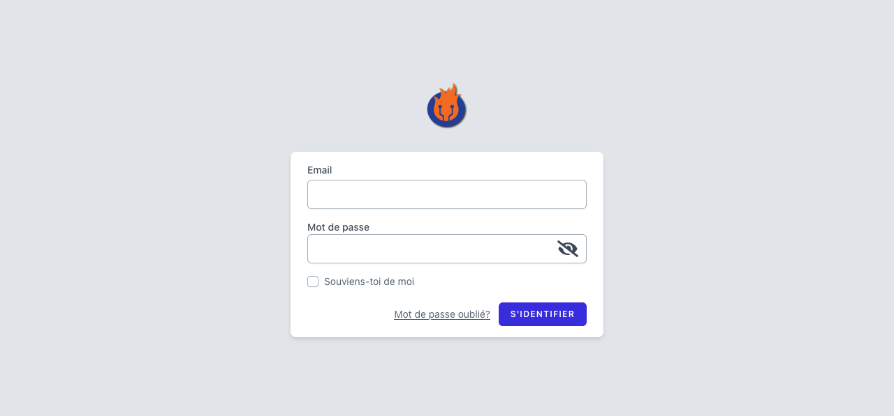
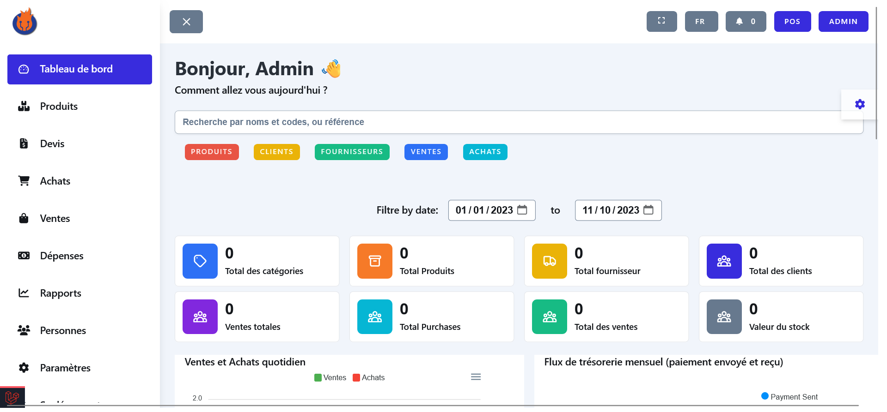
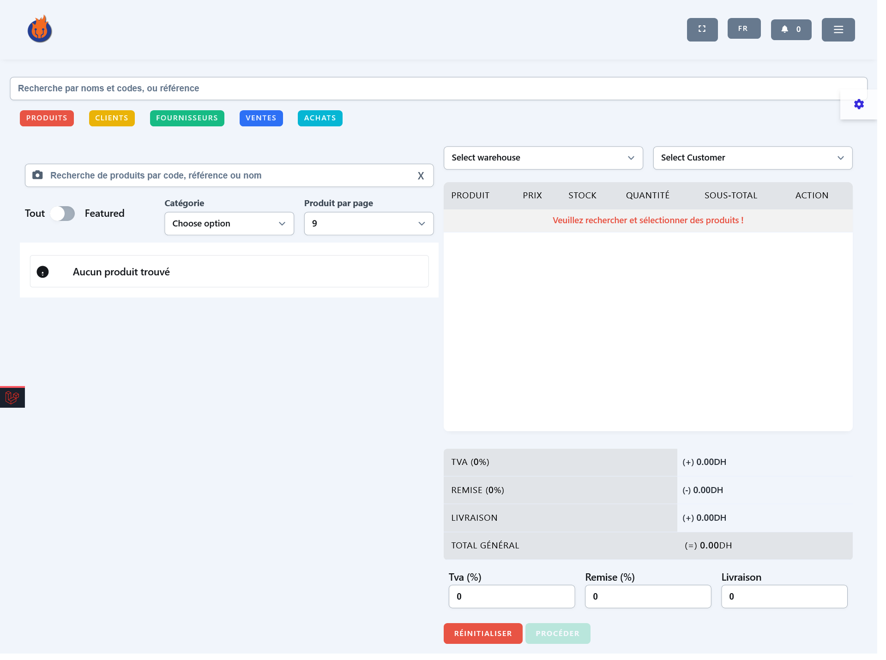
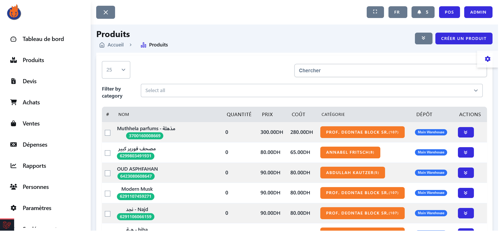
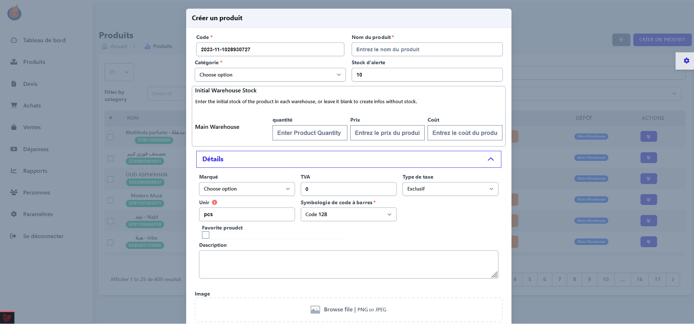
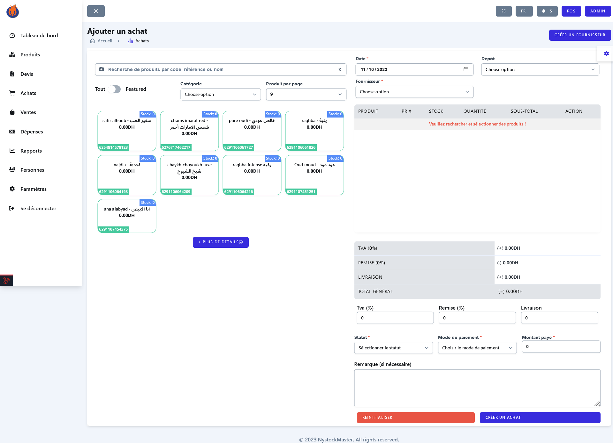
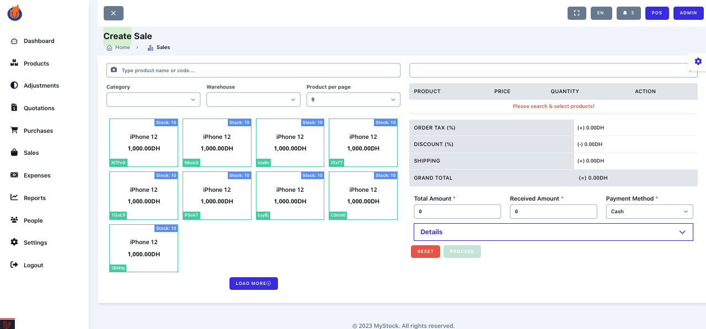
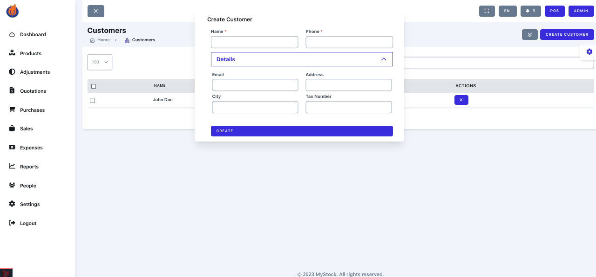

## Overview 

This app a Laravel-based inventory management system, simplifies the tracking of your inventory, sales, purchases, and more. Offering a user-friendly dashboard, intuitive reports, and an array of features, it becomes your partner in efficient business management and growth.

Features:
- Dashboard with key insights and metrics
- Products, categories, brands, and suppliers management
- Sales and purchases tracking
- Customers and user management with roles and permissions
- Settings and preferences
- Inventory adjustment and stock management
- Multi-currency support
- Warehouses multi-locations
- Local and cloud-based backup options
- Import/Export functionality
- Multi-language support
- POS integration
- Notifications and alerts
- Send product promotions to Telegram
    and more...

Built with Laravel 9, Livewire, AlpineJs, and Tailwind CSS, ensuring a fast and responsive user experience. Try it out today and witness how it streamlines inventory management, propelling your business forward.

## Login with the following credentials
    -   Email: `admin@gmail.com`
    -   Password: `password`

## Requirements

-   PHP >= 8.0 (or higher)
-   Composer
-   Node.js
-   NPM
-   MySQL

## Installation

1.  Clone the repository
2.  Run `composer install`
3.  Run `npm install`
4.  Run `npm run dev`
5.  Create a database and update the `.env` file
6.  Run `php artisan migrate --seed`
7.  run `php artisan key:generate`
8.  Run `php artisan serve`
9.  Login with the following credentials
    -   Email: `admin@gmail.com`
    -   Password: `password`
10.  Enjoy!

## License

The Laravel framework is open-sourced software licensed under the [MIT license](https://opensource.org/licenses/MIT).

## Credits

-   [Laravel](https://laravel.com/)
-   [Tailwind CSS](https://tailwindcss.com/)
-   [Livewire](https://laravel-livewire.com/)
-   [AlpineJs]()

## Screenshots : 

| Login | Dashboard | POS |
| --- | --- | --- |
|  |  |  |

| Products | Product Create | Purchase Create |
| --- | --- | --- |
|  |  |  |

| Sale Create | Customer Create |
| --- | --- |
|  |  |